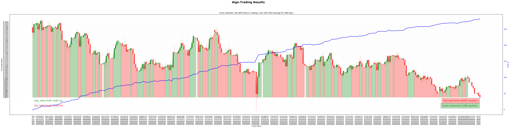

# QuantTrading_Py

A mini Quant Trading System with Alpha, Risks, Cost, Portfolio Construction Models.

## Highlight: 

**477.18**% for last 240 trade days,  using [Slope & Velocity Strategy](./alpha#strategy-4-slope--velocity).

> Shadow: Red = LONG, Green = SHORT, Black = CLOSE.

## TOC

This mini QuantTrading project will have the following components:

> Inside the Black Box : Summary

1. [Market Data](./data/README.md)
    1. [Modelling TradeDay](./data/README.md#modelling-tradeday)
    1. [Single Stock Prices](./data/README.md#single-stock-prices)
    1. [Industry Stocks Prices](./data/README.md#industry-stocks-prices)
    1. [Forex Prices](./data/README.md#forex-rate)
    1. [Data Analysis](./data/README.md#data-analysis)
    1. [Data Visualization](./data/README.md#data-visualization)
1. [Trade Strategies](./alpha/README.md#trade-strategies)
    1. [Trend Following](./alpha/README.md#strategy-1-trend-following)
    1. [Mean Reversion](./alpha/README.md#strategy-2-mean-reversion)
    1. [MA + Rolling STD](./alpha/README.md#strategy-3-moving-average--standard-deviation)
    1. [Slope & Velocity](./alpha/README.md#strategy-4-slope--velocity)
1. [Strategy Testing](./alpha/README.md#testing-strategies)
    1. [Back Testing](./alpha/README.md#back-testing)
    1. [Optimization](./alpha/README.md#strategy-optimization)
    1. [Strategy Analysis](./alpha/README.md#strategy-analysis)
1. Risk Model (Planning)
1. Transaction Cost Model (Planning)
